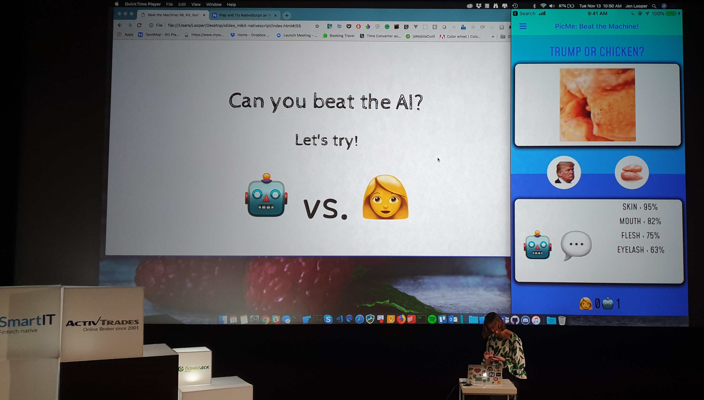
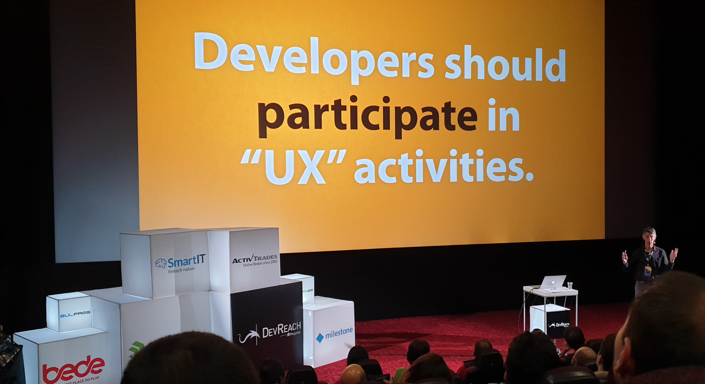
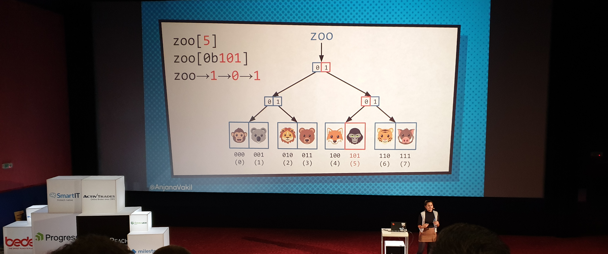
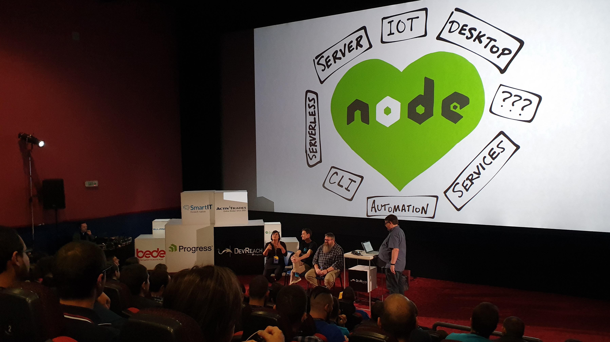
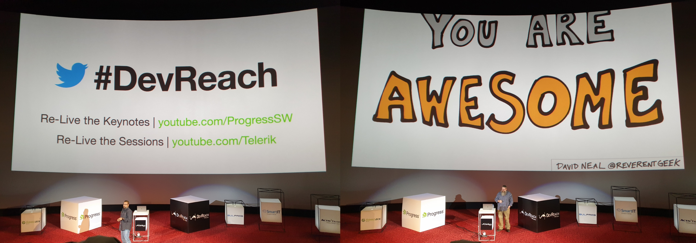

## Day 1

### Jen Looper | Human vs. AI: Build a Mobile App with Vue.js, ML Kit and Native Script
 - supervised => unsupervised => reinforcement learning
 - [TensorFlow for Poets](https://codelabs.developers.google.com/codelabs/tensorflow-for-poets/)
 - ML projects
    + [StitchFix](https://www.stitchfix.com/)
    + [SeeingAI](https://www.microsoft.com/en-us/seeing-ai)
    + [Clarifai](https://clarifai.com/)
 - [MLKit](https://developers.google.com/ml-kit/)
 - To build a mobile UI in front of ML
    + [Weex](https://weex.incubator.apache.org/)
    + [NativeScript](https://play.nativescript.org/)
 - [TensorFlow Lite](https://www.tensorflow.org/lite/) - recommended if you want to run on device such as Raspberry Pi
 - [Android Neural Network API](https://developer.android.com/ndk/guides/neuralnetworks/)
 - [Jen Looper ML comparisons in Twitter](https://twitter.com/teenybiscuit/status/707727863571582978)
 - `Tip 1`: freeze and compress your models upon usage
 - `Tip 2`: ML related courses on math in Coursera highly recommended
 
 
 
### Sebastian Witalec | Adopt an AI driven chatbot today
 - [NativeChat](https://www.progress.com/nativechat)
 - Declarative approach in JSON
 - [Try out NativeChat yourself](https://portal.nativechat.com/)
 - Progress are building this [Kinvey platform](https://www.progress.com/kinvey) for which they seem really hyped. Plus it has a `serverless architecture` - something mentioned a lot of times during the conference.
 
### Jonathan Mills | Building Progressive Web Apps with React
 - @jonathanfmills
 - [Axios](https://github.com/axios/axios) - promise based HTTP client for the browser and NodeJS
 - Two easy steps to bring web app to 90% PWA success rate in Audit
    + service workers
        + cache all data you might need to load the page if network connection is lost/bad
        + important: cache invalidation strategies
        + as a rule of thumb always load when network is available, use cache only as fallback
    + manifest
        + the thing you need to declare to "install" your webapp on a device
        + weird additional steps on IOS
        + Microsoft might never go for it. Rumor has it they fear too much for their Windows Store apps

### Dean Schuster | Building UX into Your Development Process
 - @ExperienceDean
 - People are usually bad at telling what they want
 - UX: observe and ask based on your observations
 - [TrueMatter blog](http://blog.truematter.com/)
 - Tips for remote clients:
    + work closely with your designers and product team
    + take leverage from your support to collect as much data as possible
    

 
### Anjana Vakil | Immutable Data Structures for Functional JS
 - @AnjanaVakil
 - Interesting projects she's involved in:
    + [MapBox](https://www.mapbox.com/)
    + [The Recurse Center](https://www.recurse.com/)
    + [Mozilla Tech Speakers](https://blog.mozilla.org/community/2015/06/23/mozilla-tech-speakers-a-pilot-for-technical-evangelism/)
    + [Outreachy](https://www.outreachy.org/)
 - Naive list copying is slow and memory intensive
 - Path copying
    + Optimize the copy, having smaller chunks to clone
    + Structural sharing
 - Trie
    + Array => Bitmap Vector Trie
    + 32-way branching (or 5 bits slicing) - after extensive research it was determined that on average this is the most efficient branching
        + lookup O(log32n)
        + update O(log32n)
        + O(log32n) ~ 6-7 on average ~O(1)
    + What about object?
        + hash the key to number => equivalent to the array
        + Hash Array Mapped Trie
 - Libraries
    + [ImmutableJS](https://immutables.github.io/) (Facebook, React, JavaScripty syntax)
    + [Mori](http://swannodette.github.io/mori/) (Closure, more functional syntax)
    

    
### Jeff Strauss | What You Need to Know About Open Source
 - SaaS in the company
    + not distributed
    + no license needed
 - License is always non-descriminational - cannot say it should not be used for evil
 - Everybody is allowed to build a business on OS, but you add value with Support & Services
 - MIT
    - not that good
    - never forget the attribution!
    - as is, not our problem
    - no patent
 - BSD
    - 2-BSD ~ MIT
    - 3-BSD
        + non-endorsement
        + advertisement - you need to give everywhere credit to all contributors (bad scenario: product advertisement, a LOT of contributors that have to be included)
    - no patent
 - Apache
    + patent!
    + patent assert - "if you burn me, you loose your patent"
 - GPL
    + true copyleft
    + products can only be GPS when distributed
    + in other words, product built on GPL becomes open-source
    + LGPL (less restrictive), AGPL (more)
 - Contributor Agreements
    + CLA - you give license to the company to use the code, but you still retain the copyright (you become a contributor)
    + CAA - heavier, takes away the copyright, too
 - Services
    + [WhiteSource](https://www.whitesourcesoftware.com/)
    + [BlackDuck](https://www.blackducksoftware.com/)
 - if there's no license in the repo you cannot use the code
 - [Wikipedia license comparison chart](https://en.wikipedia.org/wiki/Comparison_of_free_and_open-source_software_licenses)
 
### Jonathan Mills | Solid In JS
 - [Barbara Liskov](https://en.wikipedia.org/wiki/Barbara_Liskov)
 - `L` substitution
    + rectangle + square
    + q(rect) != q(square)
    + if you define a function that says when you change width, height should remain the same
 - `I`nterface segregation
    + split into smaller simpler units, so you can use it easier
    + facade pattern
 - `D`ependency inversion
    + depend on abstraction, not concretions
 - misc: [Solid Hackernoon article](https://hackernoon.com/solid-principles-made-easy-67b1246bcdf) (because too hungry and ate the `S` `O`)
 
 
## Day 2

### Brandon Satrom | Bending IoT To Your Will with JavaScript
 - [Gartner Hype Scale](https://www.gartner.com/en/research/methodologies/gartner-hype-cycle)
 - Projects
    + [SmartFin](https://smartfin.org/project/)
    + [BuzzBox](https://www.osbeehives.com/)
    + [Particle](https://www.particle.io/) (advertised in the talk)
    + [BlynkApp](https://www.blynk.cc/)
    + [ElectricIO](https://github.com/noopkat/electric-io)
 - [NodeRed](https://nodered.org/)
 - [OpenWeatherApi](https://openweathermap.org/api)
 - [Particle - devices to build your mesh](https://www.particle.io/mesh/buy)

### Natalia Tepluhina | Angular Features in VueJS
 - TypeScript
    + pitfall: integration with Vuex, string based actions hard to type
 - RxJS
    + [Observables](https://angular.io/guide/observables) - next level promise, reactive
    + [VueRX](https://github.com/vuejs/vue-rx)
        + `v-stream:event`
        + `domStreams`

### Tara Manicsic | Everything You Need to Node
 - @tzmaniacs + [podcast](https://www.crowdcast.io/e/dshawaf8)
 - good for streaming or handling buttload of async requests
 - Suggested articles
    + [MGechev, Mortal Kombat](https://blog.mgechev.com/2018/10/20/transfer-learning-tensorflow-js-data-augmentation-mobile-net/)
    + [How AirBnb optimized their SSR configuration](https://medium.com/airbnb-engineering/operationalizing-node-js-for-server-side-rendering-c5ba718acfc9)
    + [SSR in Angular](https://itnext.io/server-side-rendering-ssr-in-angular-5-the-simplest-and-quickest-ssr-approach-34cf53224f32)
    + [FlavioCopes](https://flaviocopes.com/)
 - [TesselIO](https://tessel.io/)
 - [JohnnyFive](http://johnny-five.io/)
 - [Vue CLI PWA Plugin](https://www.npmjs.com/package/@vue/cli-plugin-pwa)
 - built a chat app in 10 mins, efficient approach:
    + build process, speeded up into a gif + realtime commentary
    + showcase working demo at the end
 - misc: a lot of her dog in this lecture (and apparently he is called `Tosh-my-gosh`)
 - misc: mentioned she rapped last time, but refused to do so this time 
 
### Aysegul Yonet | Building WebXR Applicaions in Practice
 - @AysSomething
 - [The whole presentation](https://docs.google.com/presentation/d/1oaN4MIimJOG1ouV3E6p32s1T1XMkmfW0fhEA16JEB5M/edit)
 - [Github Repository](https://github.com/Yonet/aysLabs)
 - [Live Demo](https://yonet.github.io/aysLabs/xr/)
 - [Origin Trials](https://www.chromium.org/blink/origin-trials)
 - [PlayCanvas](https://playcanvas.com/)
 - [Scapic](https://scapic.com/)
 - [Poly](https://poly.google.com/) - if you need a 3D model to use in AR/VR
 - [ThreeJS](https://threejs.org/)
 - [Resonance Spatial Audio](https://developers.google.com/resonance-audio/)
 - [Web VR now in Canary](https://webvr.info/get-chrome/) - still experimental
 - session.requestAnimationFrame - different than the standard one, still tries to keep up the FPS
 - misc: a lot of information and links, still she managed to complete the presentation 20 mins earlier
 
### Richard Campbell | .NET Rocks - Discussion Panel (Everything you need to node)
 - Part 2 of the DevReach podcast episode
 - Guests: Tara Manicsic, Brandon Satrom and David Neal
 - [Hapi](https://hapijs.com/) vs. [Express](https://expressjs.com/)
 - [Yargs](https://github.com/yargs/yargs) to help you in the console
 - Preferred Stack
    + [Electron](https://electronjs.org/)
    + [NativeScript](https://www.nativescript.org/)
    + Serverless
 - misc: keep an eye on the .NET Rocks podcast for the full discussion
 

### David Neal | Closing Note | You are awesome
 - @reverentgeek
 - redneck 101:
    + y'all - 5 or less, or indefinite set of members of a group
    + all y'all - addresses everyone
 - misc: you are awesome
 
 

